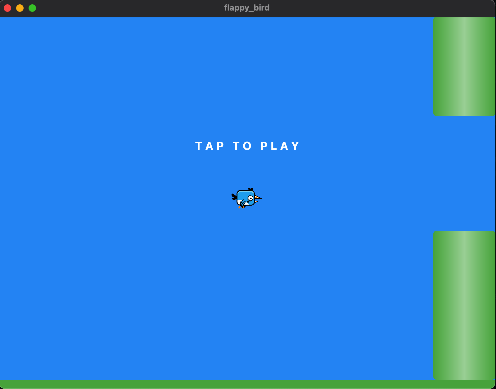

**Screen Shot**



**Getting Started**

This guide outlines the steps required to install the Flutter SDK, set up your development environment, and run your Flutter app on various platforms:

**Prerequisites:**

- A computer with a supported operating system:
  - macOS (x64)
  - Windows (x64) - 64-bit version required
  - Linux (x64) - 64-bit version required
- An internet connection for downloading the Flutter SDK
- A text editor or IDE of your choice (e.g., Visual Studio Code, Android Studio)

**Installing the Flutter SDK:**

1. **Download the Flutter SDK:**
   Visit the official Flutter website ([invalid URL removed]) and download the appropriate installation bundle for your operating system.

2. **Extract the SDK:**
   Unzip the downloaded file to a desired location on your computer. For example, on macOS, you can extract it to `/Users/<your_username>/development/flutter`.

3. **Set up your PATH (optional but recommended):**
   Adding the Flutter SDK's `bin` directory to your system's PATH environment variable will allow you to run Flutter commands from any terminal window. Here are the steps for each platform:

   - **macOS/Linux:**
     Open your terminal and run the following command, replacing `<path_to_flutter>` with the actual path where you extracted the Flutter SDK:

     ```bash
     export PATH="$PATH:<path_to_flutter>/bin"
     ```

     To make this change permanent, add this line to your shell's configuration file (e.g., `.bashrc` or `.zshrc`).

   - **Windows:**
     Search for "environment variables" in the Windows search bar. Click on "Edit the system environment variables." Under "System variables," click "New." Enter the variable name as "PATH" (if it doesn't exist) and the variable value as `<path_to_flutter>\bin`, replacing `<path_to_flutter>` with the actual path. Click "OK" to save the changes.

**Verifying the Installation:**

Open a terminal window and run the following command:

```bash
flutter doctor
```

This command should output a success message indicating that the Flutter SDK is installed and configured correctly. If you encounter any issues, follow the instructions provided by `flutter doctor` to resolve them.

**Running the App on Different Platforms:**

Once you have your project set up, you can run your Flutter app on various platforms:

- **Mobile (Android/iOS):**

  1. Connect your Android device or iOS simulator to your computer. Ensure you have the necessary development tools installed (Android Studio for Android, Xcode for iOS).

  2. Navigate to your project directory in the terminal.

  3. Run the following command to start your app:

     ```bash
     flutter run
     ```

  This command will launch the app on the connected device or simulator.

- **Web:**

  1. Navigate to your project directory in the terminal.

  2. Run the following command to build your app for the web:

     ```bash
     flutter build web
     ```

  This command will create an optimized web version of your app in the `build/web` directory. You can then open the `index.html` file in your web browser to run the app.

- **Desktop (Windows, macOS, Linux):**

  1. Navigate to your project directory in the terminal.

  2. Run the following command to build your app for the desired desktop platform (replace `<platform>` with the actual platform name):

     ```bash
     flutter build desktop --target=<platform>
     ```

  Valid platform names include `windows`, `macos`, and `linux`.

  This command will create a standalone executable file for the chosen platform in the `build/desktop` directory. You can then double-click this file to run your app.
